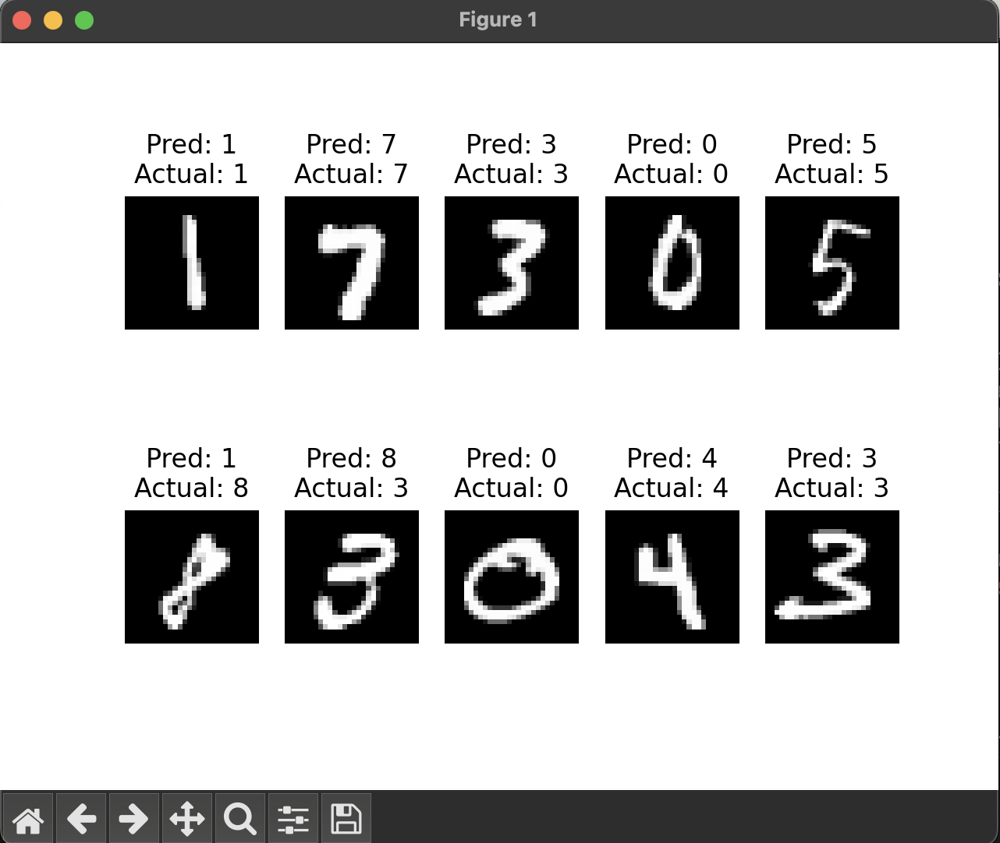

# Handwritten Digit Classification ML Learning

## No Pytorch

While libraries like pytorch offer a simple way to train, evaluate, and get predictions from models, understaning how these libraries work under-the-hood has always been challenging to me. I reproduced a digit classifier using only numpy and pandas in the Jupyter notebook and learned a lot!

## Pytorch

I also took the time to learn a bit more about how PyTorch works, and built a similar classifier with a slightly different model architecture with the help of PyTorch.
